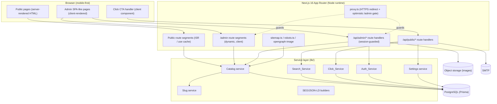
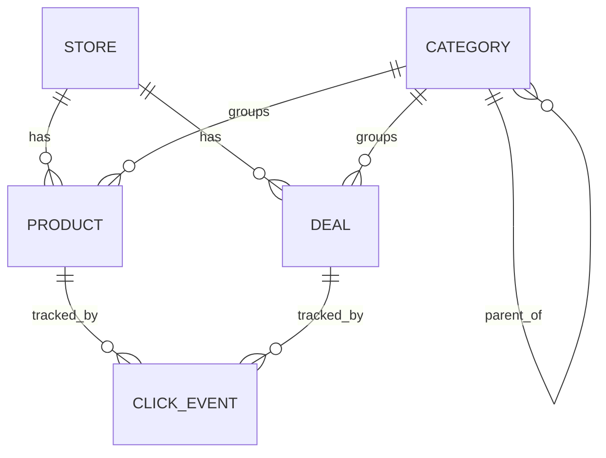

# Design Document

## Overview

DealSpark is a mobile-first, SEO-optimized affiliate product and coupon discovery platform for the Indian market. It is a single Next.js 16 (App Router) full-stack application that serves two surfaces from one codebase:

- A **public, server-rendered website** optimized for organic search (70%+ mobile traffic), built for Core Web Vitals and indexability.
- A **password-protected admin panel** under `/admin` for managing the catalog, banners, settings, and analytics.

The defining behaviors of the system are:

1. **Anonymous click tracking with atomic increments.** Every "View Deal" / "Get Coupon Code" activation logs a privacy-safe `Click_Event` and atomically increments a counter inside a single transaction so concurrent clicks are never lost.
2. **Affiliate URL confidentiality.** Affiliate destination URLs are never embedded in server-rendered HTML. The browser obtains them only as the JSON response of a `POST /api/public/click` call, then opens a new tab.
3. **Strong SEO.** Full HTML (titles, meta, canonical, Open Graph, JSON-LD) is present in the initial response before client JS runs, backed by ISR, a sitemap, and `robots.txt`.
4. **Performance budget.** LCP < 2.5s, INP < 100ms, CLS < 0.1, TTFB < 400ms (p75), and ≤ 150 KB gzipped JS on the largest public page.

### Technology Decisions

> **Important — non-standard Next.js.** This project runs **Next.js 16.2.9** with the App Router. Per `AGENTS.md`, several conventions differ from earlier versions. The design is grounded in the bundled docs (`node_modules/next/dist/docs/`). Key version-specific facts that shape this design:
>
> - **Cache Components / Partial Prerendering (PPR)** is the modern caching model (enabled via `cacheComponents: true`). Caching is opt-in through the `use cache` directive plus `cacheLife`/`cacheTag`; uncached/runtime data must live under `<Suspense>`. (`getting-started/caching.md`)
> - **Middleware is renamed `Proxy`** (`proxy.ts` at project root). Same capabilities; intended for lightweight redirects/header work, *not* full session validation. (`getting-started/proxy.md`)
> - **`GET` Route Handlers follow the page prerender model** under Cache Components; `use cache` must be extracted to a helper, not placed inline in the handler body. (`getting-started/route-handlers.md`)
> - **`params`, `searchParams`, `cookies()`, `headers()` are async** (must be awaited).
> - **`sitemap.ts` / `robots.ts`** are first-class metadata route files; `generateSitemaps` `id` is now a Promise (`v16.0.0`).
> - For instant client navigations under Cache Components, routes can export `unstable_instant`.

| Concern | Choice | Rationale |
|---|---|---|
| Framework | Next.js 16 App Router, React 19 | Required; SSR/ISR + route handlers in one app. |
| Rendering model | Cache Components (PPR) with `use cache` + `cacheLife` | Native to this version; lets static SEO shell prerender while keeping ISR semantics (Req 24.1, 25.8). |
| Language | TypeScript (strict) | Type safety for data models and route contracts. |
| Database | PostgreSQL | Needs transactional atomic counter increments (Req 7.4, 9.2/9.3) and rich querying/sorting/filtering. |
| Data access | Prisma ORM | Transactions, typed queries, `increment` atomic op. |
| Styling | Tailwind CSS v4 | Already configured; token-driven design system (Req 26). |
| Auth | Custom bcrypt + signed httpOnly session cookie (`jose`) | Single admin; no third-party identity needed (Req 13). |
| Validation | Zod schemas shared client/server | Single source of truth for form + API validation. |
| Image storage | S3-compatible object storage behind `/api/admin/upload`, served via `next/image` | Durable URLs, WebP pipeline, CDN-friendly (Req 22, 25.6). |
| Email | SMTP via Nodemailer (pluggable transport) | Contact-form admin notification (Req 12, 21.5). |
| Rich text | Sanitized HTML stored; editor (e.g. TipTap) in admin | Product descriptions (Req 16.13). |

### Out of Scope

User accounts, cashback wallet, premium membership, price tracking, reviews, loyalty, merchant self-serve, native apps, browser extensions, bots, and any public B2B API — as stated in the requirements introduction.

## Architecture

### High-Level Structure



### Rendering & Caching Strategy

The system separates **what search engines must see in HTML** from **what must stay confidential or dynamic**.

- **Public catalog pages** (`/`, `/categories`, `/category/[slug]`, `/product/[slug]`, `/deal/[slug]`, `/deals`, static pages) are prerendered into a static shell and refreshed via ISR. Data reads are wrapped in `use cache` helpers tagged so admin mutations can invalidate them. Revalidation windows per Req 25.8:
  - Homepage, Category pages, Deal pages → 300 s
  - Product pages → 600 s

  These are expressed with a custom `cacheLife` profile (`{ revalidate: 300, ... }` / `{ revalidate: 600, ... }`) on the per-page `use cache` data loaders, equivalent to the documented ISR behavior (`incremental-static-regeneration.md`): stale content is served while a fresh version regenerates in the background; if regeneration throws, the last good version keeps serving (Req 25.9).
- **Search results page** (`/search`) is **server-side rendered per request** (Req 25.11) — it reads `searchParams` and must reflect live catalog state, so its data is not cached.
- **Admin pages** are **client-rendered** (Req 25.10): each `/admin/*` page is a Client Component shell that calls `/api/admin/*` route handlers. This keeps admin interactivity rich and isolates it from the public prerender pipeline.
- **Affiliate-URL confidentiality**: Product/Deal Server Components fetch and render everything *except* the affiliate/destination URL. The URL column is excluded from the page's data projection, so it is provably absent from the static shell and the streamed RSC payload (Req 7.9, 24.1). The URL is only returned by `POST /api/public/click`.

### On-Demand Revalidation

Admin create/update/delete operations run as `/api/admin/*` route handlers (or Server Actions) that, after committing to the DB, call `revalidateTag(...)` for the affected entity tags (`products`, `product:{slug}`, `deals`, `deal:{slug}`, `categories`, `category:{slug}`, `banners`, `homepage`, `settings`). This refreshes public pages promptly without waiting for the time-based window, using stale-while-revalidate semantics (`revalidating.md`).

### Request Lifecycle: Buy / Coupon Click

```mermaid
sequenceDiagram
  participant V as Visitor (browser)
  participant P as Public page (no affiliate URL in HTML)
  participant API as POST /api/public/click
  participant CS as Click_Service
  participant DB as PostgreSQL

  V->>P: Activate "VIEW DEAL →" / "GET COUPON CODE"
  P->>API: POST {type, id} (timeout: product 5s / deal 3s)
  API->>CS: handleClick(type, id, deviceType, referrer, userAgent)
  CS->>DB: BEGIN; INSERT Click_Event; UPDATE counter +1; COMMIT
  alt active record found & tx ok
    DB-->>CS: ok
    CS-->>API: { affiliateUrl }
    API-->>P: 200 { affiliateUrl }
    P->>V: window.open(url, "_blank")  (fallback link if popup blocked)
  else no active record
    CS-->>API: 404
    API-->>P: 404 (no event, no increment)
  else tx failure
    CS-->>API: 500 (rolled back)
  else timeout / network error
    P->>V: show "couldn't open link" (product) OR open destination anyway (deal)
  end
```

> Note the deliberate behavioral asymmetry from the requirements: a **product** click that times out **must not navigate** and must inform the visitor (Req 7.7); a **deal** click that times out **should still open** the destination without blocking (Req 8.11).

### Project Layout (App Router)

```
app/
  layout.tsx                      # Root layout: Inter font, base tokens, <html lang="en">
  page.tsx                        # Homepage (ISR 300s)
  categories/page.tsx
  category/[slug]/page.tsx        # ISR 300s + generateStaticParams
  product/[slug]/page.tsx         # ISR 600s + generateStaticParams + Product JSON-LD
  deal/[slug]/page.tsx            # ISR 300s + generateStaticParams + Offer JSON-LD
  deals/page.tsx
  search/page.tsx                 # SSR per request
  about|terms|privacy/page.tsx    # static
  contact/page.tsx
  sitemap.ts                      # + product/deal/category split via generateSitemaps if >50k
  robots.ts
  opengraph-image.tsx             # default site OG image fallback
  not-found.tsx                   # 404 surface
  (admin)/admin/
    login/page.tsx
    dashboard/page.tsx
    products/...  deals/...  categories/...  banners/...  analytics/...  settings/...
  api/
    public/{search,click,contact}/route.ts
    admin/{auth,products,deals,categories,banners,settings,upload,analytics}/route.ts
proxy.ts                          # HTTPS enforcement + optimistic /admin redirect
lib/
  db.ts  slug.ts  click-service.ts  search-service.ts  auth.ts
  catalog.ts  settings.ts  seo.ts  validation/ (zod schemas)  cache-tags.ts
components/
  ProductCard.tsx  CouponCard.tsx  HeroCarousel.tsx  ClickCTA.tsx
  CountdownTimer.tsx  Filters/  admin/...
```

## Components and Interfaces

### Public UI Components

**Header (fixed)** — Site logo, search input (placeholder `"Search products, deals, stores..."`), "All Categories" link; `position: sticky/fixed` top, remains during scroll (Req 1.1). Content below is padded to avoid hiding behind it (per ui-ux-pro-max layout rule).

**HeroCarousel** (client) — Renders 1–10 active banners ordered by ascending display order; auto-advances every 4 s when >1 banner and not hovered/touched; pauses on hover/touch; hidden when zero banners; honors `prefers-reduced-motion` by disabling auto-advance (Req 1.3–1.6, 18.7, 26.10). Banner activation navigates only when link URL is a valid http/https URL; empty/malformed links are inert (Req 1.7, 1.14).

**ProductCard** — White bg, 12px radius, drop shadow, 1:1 lazy image with placeholder fallback, store name, title truncated to 2 lines, bold current price, optional strikethrough original price + integer `%` discount badge. Hosts a `ClickCTA` "VIEW DEAL →"; disabled (non-opening) when the product has no affiliate URL (Req 2). The card markup contains **no** affiliate URL.

**CouponCard** — 40px circular store logo with first-letter fallback, store name, headline truncated to 2 lines, optional dashed-border coupon-code container, optional muted expiry (≥4.5:1 contrast). The "GET COUPON CODE" CTA navigates to `/deal/[slug]` (Req 3).

**ClickCTA** (client) — Shared click handler implementing the sequence diagram: POSTs to `/api/public/click`, applies the per-type timeout, opens the returned URL in a new tab, and renders a fallback anchor when the popup is blocked. Encapsulates the product-vs-deal timeout asymmetry.

**CountdownTimer** (client) — Renders days/hours/minutes/seconds to an expiry relative to server-provided time; on reaching expiry, swaps to an "expired" message (Req 6.5/6.6, 8.6/8.12). Initial values are server-rendered to avoid layout shift (CLS) and hydration mismatch.

**Filters / SortControl** — Category-detail filtering (subcategory pills, store checkboxes, discount tiers 10/30/50%+, price range ₹0–₹1,00,000), bottom-sheet under 768px, removable filter chips, and the five sort options with "Most Popular" default (Req 5.3–5.9).

**ResponsiveGrid** — 2/3/4 columns at <768 / 768–1023 / ≥1024 px (Req 5.10, 26.7).

**Footer** — Logo, tagline, link columns, affiliate disclaimer, copyright, populated social links only; `#EFEFED` bg (Req 1.13, 20.5).

### Admin UI Components (client-rendered)

Sidebar (`#1E1E1E`), data tables with inline toggles, bulk-action bars with confirm prompts, forms with live Zod validation, rich-text editor, drag-to-reorder (banners, additional product images), image upload with preview, chart widgets (dashboard/analytics), CSV export triggers.

### Service Interfaces (`lib/`)

```ts
// lib/slug.ts
function generateSlug(source: string): string;                 // sanitize per Req 23.1/23.2
function ensureUniqueSlug(base: string, exists: (s: string) => Promise<boolean>): Promise<string>; // Req 23.3/23.4
function storeScopedSlug(storeName: string, title: string): string; // Req 24.12

// lib/click-service.ts
type ClickType = 'product' | 'deal';
interface ClickInput { type: ClickType; id: string; referrer?: string; userAgent?: string; deviceType: DeviceType; }
interface ClickResult { affiliateUrl: string; }
function handleClick(input: ClickInput): Promise<ClickResult>;  // throws NotFound | Validation | ServerError

// lib/search-service.ts
interface SearchQuery { q: string; type: 'product' | 'deal' | 'all'; offset?: number; limit?: number; }
interface SearchResults { products: ProductSummary[]; productCount: number; deals: DealSummary[]; dealCount: number; }
function search(query: SearchQuery): Promise<SearchResults>;    // Req 11, 21.1

// lib/auth.ts
function login(email: string, password: string): Promise<Session | AuthError>; // bcrypt + lockout
function createSession(adminId: string): Promise<SessionCookie>;                // httpOnly, 24h
function verifySession(token?: string): Promise<Session | null>;
function logout(token: string): Promise<void>;

// lib/catalog.ts (cached read helpers + mutations)
const getHomepageData: () => Promise<HomepageData>;             // 'use cache' cacheLife(300) cacheTag('homepage')
const getProductBySlug: (slug: string) => Promise<ProductDetail | null>; // excludes affiliateUrl from public projection
// ...category/deal/list loaders, each tagged for on-demand revalidation

// lib/pricing.ts
function computeDiscountPercent(current: number, original?: number): number | null; // Req 16.6, 6.4
```

### HTTP API Contracts

**`GET /api/public/search?q=&type=`** → `200 { products, productCount, deals, dealCount }`; empty matches return empty collections with success (Req 21.2); missing/invalid params → `400` (Req 21.7).

**`POST /api/public/click`** body `{ type: 'product'|'deal', id }` → `200 { affiliateUrl }`; unknown/inactive id → `404` (no event, no increment); invalid/missing/oversized field → `400`; tx failure → `500` (Req 7, 9, 21.3/21.4). Server derives `deviceType` from User-Agent, caps `referrer` ≤ 2048 and `userAgent` ≤ 1024 chars, and strips any PII fields (Req 27.1/27.2).

**`POST /api/public/contact`** → validates Name/Email/Subject/Message, persists `ContactMessage`, triggers admin email; persists even if email send fails (Req 12, 21.5/21.6).

**`/api/admin/*`** — all require a valid session cookie or return `401` (Req 13.8). Includes CRUD for catalog/banners/settings, `POST /api/admin/upload` (Req 22), and analytics/export endpoints.

### Auth & Authorization Flow

- `proxy.ts` performs **HTTPS enforcement** (redirect HTTP→HTTPS, Req 27.6) and an **optimistic** redirect of unauthenticated `/admin/*` (except `/admin/login`) to `/admin/login` based on cookie presence. Per the docs, Proxy is not a full auth solution, so the **authoritative** check is a `verifySession` call inside each admin layout/route handler; `/api/admin/*` returns `401` without a valid session (Req 13.1, 13.8).
- Login uses bcrypt verification with a **rate limiter**: 5 consecutive failures within 15 minutes locks the account for 15 minutes (Req 13.5), tracked in a `LoginAttempt` store keyed by admin account.
- Session: signed httpOnly cookie, `Secure`, `SameSite=Lax`, 24h expiry (Req 13.2); logout invalidates it (Req 13.7).

## Data Models

All monetary values are stored as integers in paise (or as `Decimal`) to avoid float drift; prices validated to the range 0.01–999,999,999.99. Timestamps are stored in UTC; admin-facing day/range computations apply the system/admin time zone.



```ts
type EntityStatus = 'active' | 'inactive';
type DealType = 'coupon_code' | 'direct_deal' | 'bank_card' | 'cashback';
type DeviceType = 'mobile' | 'tablet' | 'desktop' | 'unknown';
type LinkTarget = 'same_tab' | 'new_tab';

interface Category {
  id: string;
  name: string;                 // 1..100 trimmed
  slug: string;                 // unique, lowercase, hyphenated (Req 23)
  parentId: string | null;
  iconUrl: string | null;
  description: string | null;
  showOnHomepage: boolean;
  homepageSectionTitle: string | null;
  displayOrder: number;         // 0..9999
  status: EntityStatus;
  metaTitle: string | null;     // default "[Category] Deals & Coupons | DealSpark"
  metaDescription: string | null;
  createdAt: Date; updatedAt: Date;
}

interface Store {
  id: string; name: string; slug: string; logoUrl: string | null; createdAt: Date;
}

interface Product {
  id: string;
  title: string;                // 1..200
  slug: string;                 // store-scoped, unique (Req 24.12)
  storeId: string; categoryId: string;
  currentPrice: number;         // 0.01..999,999,999.99
  originalPrice: number | null; // must be > currentPrice when present
  discountPercent: number | null; // derived 1..100
  primaryImageUrl: string;
  additionalImages: string[];   // <=4
  description: string;          // sanitized rich HTML
  keyFeatures: string[];        // <=8, each <=120 chars
  affiliateUrl: string;         // NEVER projected to public HTML
  buttonLabel: string;
  offerExpiresAt: Date | null;
  featured: boolean;
  status: EntityStatus;
  viewCount: number;            // "Most Popular" sort
  clickCount: number;           // atomic increment
  lastVerifiedAt: Date;
  metaTitle: string | null; metaDescription: string | null;
  createdAt: Date; updatedAt: Date;
}

interface Deal {
  id: string;
  headline: string;             // 1..120
  slug: string;                 // store-scoped, unique
  storeId: string; categoryId: string;
  dealType: DealType;
  couponCode: string | null;    // required & 1..50 when dealType=coupon_code
  destinationUrl: string;       // http/https, <=2048; NEVER projected to public HTML
  discountValue: string | null;
  buttonLabel: string | null;
  terms: string | null;
  howToUseSteps: string[];      // 3..5 rendered
  validFrom: Date | null; validUntil: Date | null; // validFrom <= validUntil
  minOrderValue: number | null; maxDiscountCap: number | null;
  applicableFor: string | null;
  featured: boolean;
  status: EntityStatus;
  clickCount: number;
  createdAt: Date; updatedAt: Date;
}

interface Banner {
  id: string; internalName: string;       // 1..100
  imageUrl: string; mobileImageUrl: string | null;
  headline: string | null; ctaText: string | null; // <=100 / <=30
  linkUrl: string;                          // http/https
  linkTarget: LinkTarget;
  displayOrder: number; status: EntityStatus; createdAt: Date;
}

interface ClickEvent {
  id: string;
  clickType: ClickType;
  productId: string | null; dealId: string | null;
  deviceType: DeviceType;
  referrer: string;            // <=2048, may be ''
  userAgent: string;           // <=1024, may be ''
  createdAt: Date;             // TTL: delete > 90 days
  // No IP, email, name, phone, gov id, or account id (Req 27.1)
}

interface ContactMessage {
  id: string; name: string; email: string; subject: string; message: string; createdAt: Date;
}

interface SearchLog { id: string; query: string; resultCount: number; createdAt: Date; } // Req 19.8

interface AdminUser { id: string; email: string; passwordHash: string; createdAt: Date; updatedAt: Date; }

interface Settings {                        // singleton row
  siteName: string; tagline: string; logoUrl: string | null; faviconUrl: string | null;
  contactEmail: string; adminEmailNotifications: boolean;
  defaultMetaTitleSuffix: string; defaultMetaDescription: string;
  ga4MeasurementId: string; searchConsoleCode: string;
  social: { facebook: string; instagram: string; twitter: string; youtube: string };
  defaultAffiliateDisclosure: string;
}
```

**Indexes & integrity**

- Unique indexes on `Category.slug`, `Product.slug`, `Deal.slug`, `Store.slug` (case-sensitive exact match — Req 23.3/23.5).
- Composite/partial indexes for hot reads: `Product(status, categoryId, currentPrice/clickCount/createdAt/discountPercent)` for sort modes; `Deal(status, createdAt)`; `Banner(status, displayOrder)`; `ClickEvent(createdAt)` for TTL and trailing-window analytics; trigram (`pg_trgm`) indexes on searchable text fields.
- Category delete is rejected while it has child categories or associated products (Req 15.10), enforced at the service layer plus FK constraints.
- Click increment uses `UPDATE ... SET click_count = click_count + 1` (Prisma `increment`) inside the same transaction as the `ClickEvent` insert; failure rolls back both (Req 9.2/9.3).

## Correctness Properties

*A property is a characteristic or behavior that should hold true across all valid executions of a system — essentially, a formal statement about what the system should do. Properties serve as the bridge between human-readable specifications and machine-verifiable correctness guarantees.*

These properties target the pure, input-varying logic of DealSpark — slug generation, discount math, click tracking, search, validation, ordering/paging, analytics aggregation, auth, and SEO output. Property-based tests should run a minimum of 100 generated iterations each. Visual/layout, Core Web Vitals, ISR/CDN, and HTTPS-redirect behaviors are validated through example, integration, smoke, and lab tests instead (see Testing Strategy).

### Property 1: Slug shape, fallback, and store tokens

*For any* source name or title string (including empty, whitespace-only, punctuation-only, and non-Latin inputs), the generated slug consists only of lowercase letters, digits, and single hyphens (matching `^[a-z0-9]+(-[a-z0-9]+)*$`), has length between 1 and 200, and is never empty; *and for any* (store name, title) pair, the store-scoped slug additionally contains the sanitized tokens of the store name.

**Validates: Requirements 23.1, 23.2, 24.12, 15.5**

### Property 2: Slug uniqueness via smallest free suffix

*For any* sequence of source names inserted into a collection, every resulting slug is distinct and valid-shaped; *and* when a derived slug collides, the system appends `-n` using the smallest integer starting at 2 that yields uniqueness while keeping the slug within 200 characters.

**Validates: Requirements 23.3, 23.4, 15.6**

### Property 3: Slug resolution round-trip and 404

*For any* active entry, requesting its exact (case-sensitive) slug resolves to exactly that single entry; *and for any* slug not present among the active entries of a collection, resolution returns not-found and resolves to no other entry.

**Validates: Requirements 23.5, 23.6, 5.2, 6.2, 8.2**

### Property 4: Discount percentage computation and rejection

*For any* current price and original price where original > current, the computed discount percentage equals `round((original − current) / original × 100)` and lies between 1 and 100; *and for any* original ≤ current, the system computes no discount and the input is rejected as invalid.

**Validates: Requirements 16.6, 6.4, 16.7**

### Property 5: Atomic, lossless click increment

*For any* number N of concurrent click requests against a single active record, the record's final click count equals its initial count plus the number of successful clicks (no increments lost), and exactly one `Click_Event` is persisted per successful click.

**Validates: Requirements 7.4, 9.2**

### Property 6: Click event persistence with field caps and defaults

*For any* valid click input, the persisted `Click_Event` records the click type, item identifier, device type, creation timestamp, a referrer truncated to at most 2048 characters, and a user agent truncated to at most 1024 characters; *and* when the referrer or user agent is omitted, the corresponding stored field is the empty string.

**Validates: Requirements 7.2, 9.1, 7.3**

### Property 7: Successful click returns the destination URL

*For any* active product or deal, a successful click logging operation returns that record's non-empty affiliate/destination URL in the response body.

**Validates: Requirements 7.5, 9.4**

### Property 8: Unknown identifier yields 404 with no mutation

*For any* click request whose identifier matches no active record, the service returns a 404 response, persists no `Click_Event`, and leaves every click count unchanged.

**Validates: Requirements 7.10, 9.5, 21.4**

### Property 9: Malformed click payload yields 400 with no mutation

*For any* click payload that omits the identifier, carries an identifier longer than 64 characters, or omits a required field, the service returns a 400 response identifying the invalid field and makes no change to any stored event or click count.

**Validates: Requirements 9.6, 21.7**

### Property 10: Failed transaction rolls back completely

*For any* click input processed while the persistence transaction fails, the post-operation state equals the pre-operation state (neither a new `Click_Event` nor an incremented count is retained) and a server-error response is returned.

**Validates: Requirements 9.3**

### Property 11: Affiliate URLs are absent from server-rendered output

*For any* product or deal, the server-rendered HTML (and serialized RSC payload) of its public page does not contain that record's affiliate/destination URL string.

**Validates: Requirements 7.9, 24.1**

### Property 12: Click events exclude personally identifiable information

*For any* incoming click payload — including payloads augmented with PII-classified fields (full IP, email, full name, phone, government identifier, or account identifier) — the persisted `Click_Event` and any analytics export contain none of those fields or their values.

**Validates: Requirements 27.1, 27.2, 19.11**

### Property 13: Click-event TTL deletes exactly the expired events

*For any* set of stored click events and a current time, applying the time-to-live process deletes exactly those events whose creation timestamp is more than 90 days (7,776,000 seconds) before the current time, and retains all others.

**Validates: Requirements 27.3, 27.4**

### Property 14: Search soundness, completeness, case-insensitivity, counts, and limit

*For any* catalog and any query of at least 2 characters, every returned result contains the query as a case-insensitive substring of at least one searchable field (title, description, store name, category name, deal headline, or coupon code); every active item that contains the query appears in the full result set; the result set is invariant under changing the query's letter case; the reported product/coupon counts equal the sizes of the respective matching sets; and the number of results returned in one page does not exceed the limit (≤ 50).

**Validates: Requirements 11.3, 11.4, 11.5, 11.7, 21.1, 21.2**

### Property 15: Exact title matches rank ahead of partial matches

*For any* query and catalog, no result whose match is only a partial match appears before any result that is an exact product-title match.

**Validates: Requirements 11.6**

### Property 16: Validation predicates accept exactly the conforming inputs

*For any* generated form input across the validated schemas (contact, category, product, deal, banner, settings, and analytics date-range), the validator accepts the input if and only if every field constraint is satisfied — required-field presence, min/max lengths, numeric ranges (e.g. price 0.01–999,999,999.99, display order 0–9999, password 8–128), email pattern `local-part@domain.tld`, absolute/`http(s)` URL schemes, conditional rules (coupon-code type requires a code), and date order (`validFrom ≤ validUntil`, range start ≤ end and span ≤ 366 days) — and otherwise rejects it while identifying each invalid field.

**Validates: Requirements 12.3, 12.5, 15.3, 15.4, 15.8, 16.4, 16.5, 17.3, 17.4, 17.7, 17.9, 18.4, 20.2, 20.6, 20.10, 19.2, 19.3**

### Property 17: Upload validation maps inputs to accept or the correct error

*For any* (MIME type, byte size, presence) triple sent to the upload endpoint, the request succeeds with a resolvable public URL if and only if a file is present, its type is one of JPEG/PNG/WebP/GIF, and its size is between 1 byte and 5 MB; otherwise it is rejected with a 400 whose reason corresponds to the specific violation (missing file, unsupported type, or oversize).

**Validates: Requirements 22.1, 22.3, 22.4, 22.5**

### Property 18: Listings respect their comparator and cap

*For any* collection and any supported ordering (category ordering by descending active-product count then name/display-order tiebreak; product sort modes Most Popular / Newest / Price Low-High / Price High-Low / Biggest Discount; deals by descending creation date; top-N by descending clicks with recency tiebreak), the rendered list is a permutation of the eligible items arranged in the comparator's order and never exceeds the section's item cap.

**Validates: Requirements 4.3, 1.8, 5.5, 10.1, 14.4**

### Property 19: Filters return exactly the items matching all active filters

*For any* set of active filters (subcategory, stores, discount tier, price range), every product in the result satisfies every active filter simultaneously, and every eligible product excluded from the result violates at least one active filter.

**Validates: Requirements 5.7**

### Property 20: "Load More" paging reconstructs the full ordered list exactly once

*For any* eligible ordered list, concatenating the successive 20-item pages produced by repeated "Load More" actions reproduces the full ordered list with every item appearing exactly once and in order, with no gaps or duplicates, and the control is hidden precisely when no further items remain.

**Validates: Requirements 5.11, 10.2, 10.3, 11.8, 11.9**

### Property 21: Analytics aggregation and zero-filled day series

*For any* set of click events and a selected date range, the period total equals the count of events whose timestamp falls within the inclusive range; the per-day series has one entry per day in the range, each equal to that day's event count (0 when none), and the series sums to the period total; any metric with no underlying data defaults to 0.

**Validates: Requirements 14.1, 19.4, 14.3, 19.5**

### Property 22: Login lockout after repeated failures

*For any* timeline of login attempts for an account, a submitted attempt is rejected as temporarily locked exactly when 5 or more failed attempts have occurred within the trailing 15-minute window, and the account becomes accept-eligible again once that window has elapsed.

**Validates: Requirements 13.5**

### Property 23: Password hashing round-trip

*For any* password satisfying the policy (8–128 characters), verifying the stored bcrypt hash against the original password succeeds, and verifying it against any different password fails.

**Validates: Requirements 13.6, 20.8**

### Property 24: Sitemap completeness and 50,000-URL partitioning

*For any* catalog, the set of URLs emitted by the sitemap equals the set of absolute canonical URLs of exactly the active categories, products, and deals (excluding every inactive, deleted, or unpublished entry); *and* when the active count exceeds 50,000, the entries are partitioned across files of at most 50,000 URLs each whose union equals the full active URL set, referenced from a sitemap index.

**Validates: Requirements 24.2, 24.3**

### Property 25: Per-page SEO invariants

*For any* public page, the server-rendered output contains exactly one canonical link element holding an absolute URL; Open Graph title, description, image, and URL tags each have a non-empty value, with the image defaulting to the designated site image when the page has none; every content image carries a non-empty alt attribute of 1–125 characters while purely decorative images carry an empty alt; and for any page within a paginated set, the canonical URL equals the absolute URL of the first page.

**Validates: Requirements 24.6, 24.7, 24.8, 24.10, 24.11, 24.1**

### Property 26: JSON-LD presence and safe round-trip

*For any* homepage, category, product, or deal page, the rendered structured data includes the correct `@type` (WebSite + SearchAction on the homepage, Product on product pages, Offer on deal pages, BreadcrumbList on category and product pages) and remains valid JSON after the XSS-safe `<` → `\u003c` escaping, such that parsing the emitted script content yields the original structured object.

**Validates: Requirements 24.9**

## Error Handling

| Scenario | Handling | Requirement |
|---|---|---|
| Unknown public slug (`/product`, `/deal`, `/category`) | `notFound()` → 404 page; product 404 renders within 2 s | 5.2, 6.2, 8.2, 23.6 |
| Click id not an active record | 404 JSON, no event, no increment | 7.10, 9.5, 21.4 |
| Malformed click/search/contact params | 400 identifying the invalid parameter, no mutation | 9.6, 21.7 |
| Click transaction failure | Roll back event + increment, return 500 | 9.3 |
| Product click POST timeout (>5 s) / network error | Inform visitor "couldn't open link", do **not** navigate | 7.7 |
| Deal click POST timeout (>3 s) | Open destination URL anyway, do not block | 8.11 |
| Browser blocks new tab | Present explicit destination link | 7.8 |
| Clipboard write fails (copy code) | Render code as selectable text + error note, still open destination | 8.10 |
| Image fails to load | 1:1 placeholder (product) / first-letter avatar (coupon/store logo) | 2.7, 3.2 |
| Inter font fails to load | System sans-serif fallback via `next/font` fallback stack | 26.4 |
| ISR regeneration throws | Continue serving last good page; retry next request | 25.9 |
| Sitemap source unavailable | Error response, not a partial/empty 200 | 24.4 |
| Contact email send fails | Persist `ContactMessage`, show retry prompt | 12.6, 21.6 |
| Unauthenticated `/admin/*` page | Proxy + layout redirect to `/admin/login` | 13.1, 14.2 |
| Unauthenticated `/api/admin/*` | 401 | 13.8, 22.2 |
| Login: invalid creds / empty field / locked | Specific message, no session established | 13.3, 13.4, 13.5 |
| Empty states (categories, deals, products, search, filters) | Render empty-state message, retain active filter chips | 4.7, 5.9, 10.5, 11.12, 15.2, 16.3, 18.2 |
| Analytics range invalid (start>end or >366d) | Validation message, retain previous range, no recompute | 19.3 |
| HTTP request to any page | Redirect to HTTPS equivalent | 27.6 |

Validation uses shared Zod schemas so the same rules run on the client (instant feedback, value retention) and server (authoritative rejection). API errors use a consistent JSON envelope `{ error: { field?, message } }`.

## Testing Strategy

A dual approach: **property-based tests** verify the universal properties above across generated inputs; **example, edge-case, integration, smoke, and lab tests** cover concrete behaviors, UI, framework integration, and performance.

### Property-Based Testing

- **Library:** `fast-check` integrated with `vitest` (the standard PBT choice for the TypeScript/Next ecosystem). Do not hand-roll property testing.
- **Iterations:** minimum 100 generated cases per property.
- **Tagging:** each property test is tagged with a comment in the form
  `// Feature: dealspark, Property {number}: {property text}`
  and references the design property it implements.
- **Isolation of side effects:** click atomicity, rollback, TTL, and validation properties run against an in-memory transactional model / mocked Prisma client so 100+ iterations stay fast and deterministic; the same logic is then covered end-to-end by a small number of integration tests against a real PostgreSQL (e.g. Testcontainers) to confirm the model matches the database.
- **Coverage map:** Properties 1–4 (slug, discount), 5–13 (click service, PII, TTL), 14–15 (search), 16–17 (validation, upload), 18–20 (ordering, filtering, paging), 21 (analytics), 22–23 (auth), 24–26 (SEO/sitemap/JSON-LD).

### Unit & Example Tests

- Card rendering: shadows/radii, 2-line truncation with ellipsis, strikethrough/badge presence, disabled CTA when no affiliate URL, lazy-load attribute, placeholder fallbacks (Req 2, 3).
- HeroCarousel timing with fake timers: 4 s auto-advance, pause on hover/touch, hidden when zero banners, reduced-motion disables auto-advance (Req 1.3–1.6, 26.10).
- ClickCTA branch behaviors: success opens tab, popup-block fallback link, product-timeout vs deal-timeout asymmetry (Req 7.7, 7.8, 8.11).
- Copy-code flow with mocked clipboard: success label swap + revert + open; failure path (Req 8.4, 8.10).
- Countdown timer reaching expiry swaps to expired text (Req 6.6, 8.12).
- Search zero-results renders suggestions + popular products (Req 11.12); search debounce timing (Req 11.2).
- Auth: 24 h session validity boundary, redirect/401 gating per route (Req 13.1, 13.2, 13.8).

### Integration Tests

- Click endpoint against real PostgreSQL: concurrent increments, transactional rollback, 404/400 paths.
- ISR behavior: observe `x-nextjs-cache` (`HIT`/`STALE`/`MISS`/`REVALIDATED`), confirm 300 s/600 s windows and serve-last-good on regeneration failure (Req 25.8, 25.9).
- On-demand revalidation: admin mutation → `revalidateTag` → public page reflects change.
- `next/image` serves WebP with raster fallback (Req 25.6, 25.7).
- Contact endpoint persists message and triggers email; email-failure still persists (Req 12, 21.5/21.6).
- Upload endpoint stores file and returns a resolvable public URL; 401 without auth (Req 22).

### Smoke / Config Tests

- `robots.ts` disallows `/admin` and `/api` and references the sitemap (Req 24.5).
- Admin pages render on the client; search page renders via SSR (Req 25.10, 25.11).
- `cacheComponents` enabled; HTTPS redirect configured in `proxy.ts` (Req 27.5/27.6).

### Lab / Field Performance Tests

- Lighthouse / WebPageTest on 4G mobile profile and CI performance budgets: LCP < 2.5 s, INP < 100 ms, CLS < 0.1, TTFB < 400 ms (p75), and ≤ 150 KB gzipped JS on the largest public page (Req 25.1–25.5). These are measured, not unit-asserted; budgets are enforced in CI.

### Accessibility Tests

- Automated contrast assertions for normal text (≥ 4.5:1), large text/UI boundaries (≥ 3:1), and muted expiry text (≥ 4.5:1) using the defined tokens (Req 3.5, 26.9).
- Keyboard focus indicator visibility (≥ 2px, ≥ 3:1) and alt-text presence per image (Req 26.8, 24.10).
- Full WCAG conformance additionally requires manual testing with assistive technologies and expert review.
